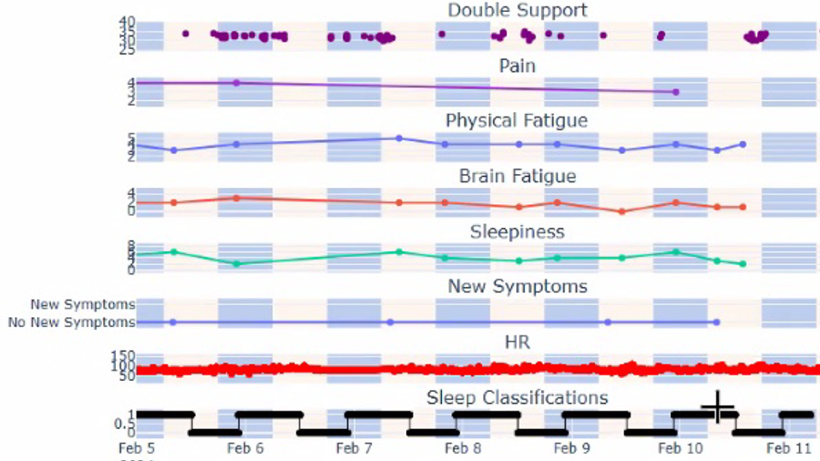

# Yawnalyzer™

## Description
Automated data cleaning and sleep/gait metrics for Apple Watch data collected via SensorKit and ResearchKit.



## Quick Start Guide
+ To use this with your own data, first download and extract this repository (or clone it)
+ Install required packages using either of the following methods in your virtual environment
    + ```pip install -r requirement.txt```
    + (when in the folder in ```pyoproject.toml``` file) ```uv sync``` 
+ Install Quarto CLI
+ Use the `PathKeeper_template.py` file to create a personalized `PathKeeper.py` file.


## Documentation
+ The full documentation is available at the Esinberg Family Depression Center's Health Research Resource Library: [https://michmed.org/efdc-kb](https://michmed.org/efdc-kb)


## Additional Resources
+ Quarto CLI Download: [https://quarto.org/docs/get-started/](https://quarto.org/docs/get-started/])


## About the Team
This project is a collaboration between the [Braley Lab](https://medschool.umich.edu/profile/1267/tiffany-j-braley) at at the University of Michigan Multiple Sclerosis and Sleep Medicine Divisions, the University of Michigan [HomeLab](https://homelab.isr.umich.edu/), and the [Eisenberg Family Depression Center](https://depressioncenter.org/).


## Contact
For questions about this study or the science behind the code, please contact Dr. Tiffany Braley, MD, MS, at tbraley@med.umich.edu.

For technical questions, please contact the project maintainers at: efdc-mobiletech@umich.edu.


## Credits
#### Contributors:
+ [Tiffany Braley, MD, MS](https://www.medicine.umich.edu/dept/mni/tiffany-braley-md), Holtom-Garrett Family Professor of Neurology, Brailey Lab, University of Michigan Medical School.
+ Brandon Labbree [(@blabbree)](https://github.com/blabbree), Research Lab Manager, University of Michigan HomeLab
+ Gabriel Mongefranco [(@gabrielmongefranco)](https://github.com/gabrielmongefranco), Mobile Data Architect, Mobile Technologies Core, Eisenberg Family Depression Center
+ Eisenberg Family Depression Center [(@DepressionCenter)](https://github.com/DepressionCenter/)


#### This work is based in part on the following projects, libraries and/or studies:
+ Apple HealthKit
+ [Arcascope](https://arcascope.com/) custom research data collection application
+ For a listing of libraries used, please see the source code headers


## License
### Copyright Notice
Yawnalyzer™ is a trademark of the Regents of the University of Michigan.
Copyright © 2025-2026 The Regents of the University of Michigan.


### Software and Library License Notice
This program is free software: you can redistribute it and/or modify it under the terms of the GNU General Public License as published by the Free Software Foundation, either version 3 of the License, or (at your option) any later version.

This program is distributed in the hope that it will be useful, but WITHOUT ANY WARRANTY; without even the implied warranty of MERCHANTABILITY or FITNESS FOR A PARTICULAR PURPOSE. See the GNU General Public License for more details.

You should have received a copy of the GNU General Public License along with this program. If not, see <https://www.gnu.org/licenses/gpl-3.0-standalone.html>.


### Documentation License Notice
Permission is granted to copy, distribute and/or modify this document 
under the terms of the GNU Free Documentation License, Version 1.3 
or any later version published by the Free Software Foundation; 
with no Invariant Sections, no Front-Cover Texts, and no Back-Cover Texts. 
You should have received a copy of the license included in the section entitled "GNU 
Free Documentation License". If not, see <https://www.gnu.org/licenses/fdl-1.3-standalone.html>


## Citation
If you find this repository, code or paper useful for your research, please cite it.

----

Copyright © 2025-2026 The Regents of the University of Michigan
